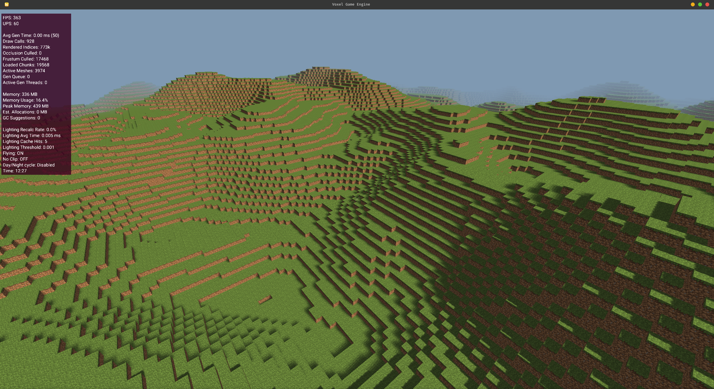
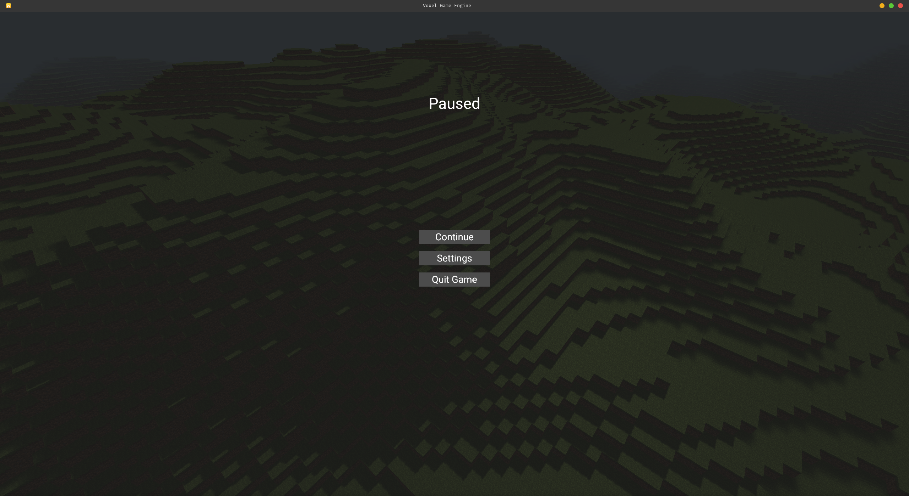
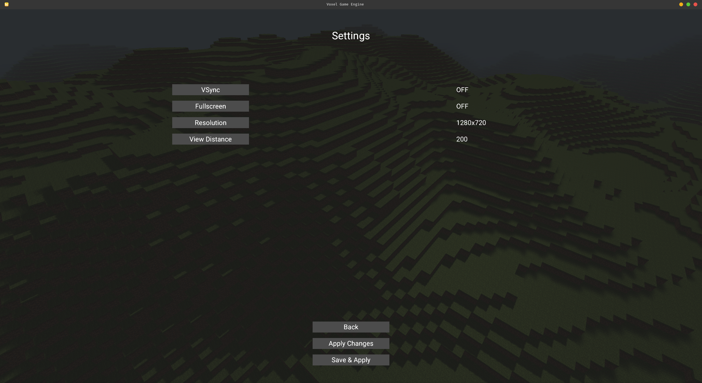
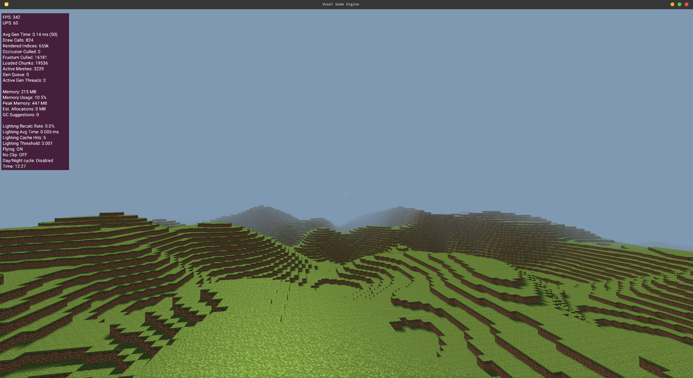
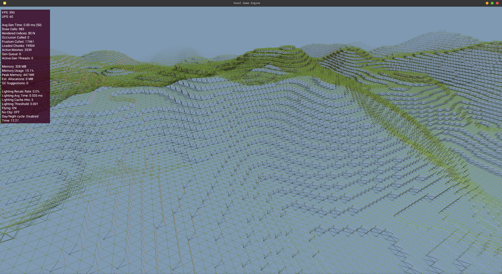
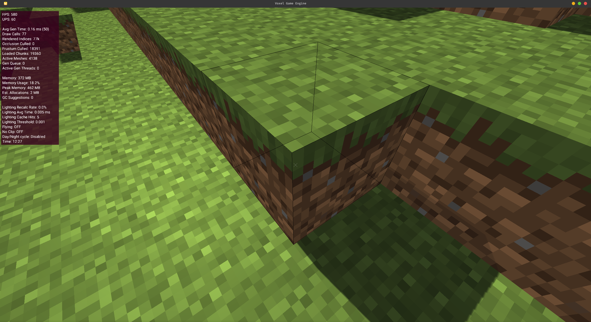
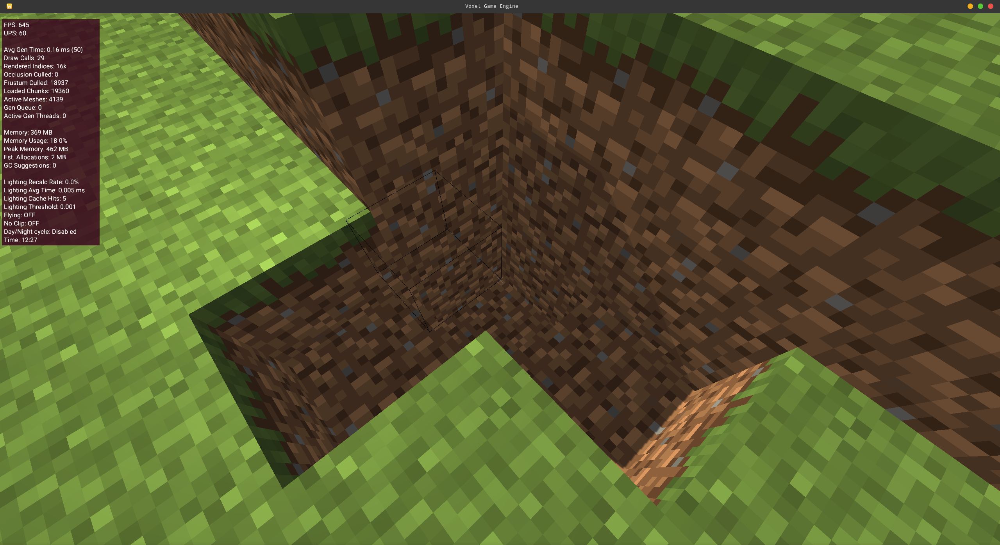
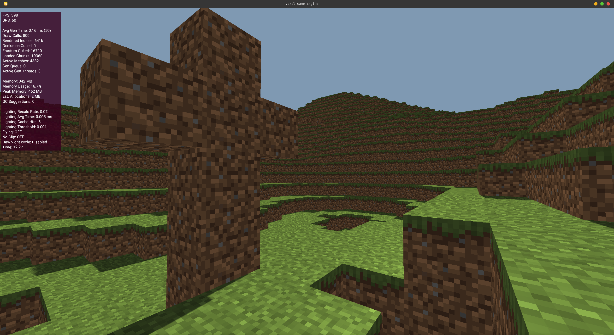

# Running










## Prerequisites

- **JDK 21** (the build uses a Java 21 toolchain). Verify with `java -version`.
- A GPU/driver with **OpenGL** support (LWJGL + GLFW open a native window).
- Linux/macOS/Windows. On Linux/macOS use `./gradlew`; on Windows use `gradle`
  (see the `Makefile`).

## First-time setup

The Gradle wrapper JAR ships with the repo, but the wrapper properties file may
be missing. If you see:

```
Wrapper properties file '.../gradle/wrapper/gradle-wrapper.properties' does not exist.
```

create `gradle/wrapper/gradle-wrapper.properties` with:

```properties
distributionBase=GRADLE_USER_HOME
distributionPath=wrapper/dists
distributionUrl=https\://services.gradle.org/distributions/gradle-8.10.2-bin.zip
networkTimeout=10000
validateDistributionUrl=true
zipStoreBase=GRADLE_USER_HOME
zipStorePath=wrapper/dists
```

Make the wrapper executable (Linux/macOS):

```sh
chmod +x gradlew
```

## Run the game

```sh
./gradlew :launcher:run
# or
make run
```

The first run downloads Gradle and dependencies, so it takes a couple of
minutes. A game window will open; use the pause menu to quit.

## Other useful commands

| Task            | Command                        |
| --------------- | ------------------------------ |
| Build           | `make build` / `./gradlew build` |
| Run tests       | `make test` / `./gradlew test`   |
| Clean           | `make clean` / `./gradlew clean` |
| Fat/runnable JAR| `make fat-jar` / `./gradlew :launcher:shadowJar` |
