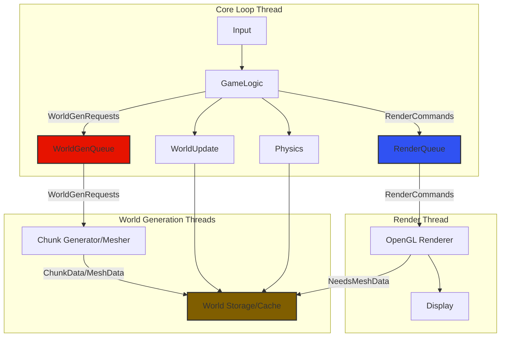
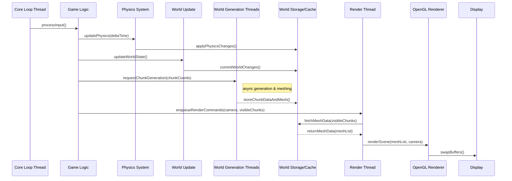

# Voxel Game Engine - Planning Document

## 1. Executive Summary

This document outlines the plan for developing a modular, performant, voxel-based game engine using Java 21 and LWJGL 3. Inspired by Minecraft Alpha, the engine will feature an infinite procedural world, core block mechanics, and a multithreaded architecture. The initial focus (MVP) is on establishing the core engine systems and basic gameplay, built upon a multi-project Gradle structure for maximum flexibility and future expansion. Key technologies include JOML for math, FastNoise Lite for world generation, FastUtil for optimized data structures, and SLF4j/Logback for robust logging.

## 2. Project Overview & Objectives

### 2.1. Overview

The project aims to create a custom voxel game engine from the ground up. It serves as both a learning exercise and a foundation for potential future game projects. The design emphasizes clean architecture, modularity, and runtime performance.

### 2.2. Objectives

* **Modularity:** Design components (rendering, physics, world management, etc.) with clear interfaces to allow easy modification, replacement, or extension.
* **Performance:** Achieve high runtime performance through multithreading, optimized data structures (FastUtil), and efficient OpenGL usage (LWJGL 3). Target smooth frame rates (e.g., 60+ FPS) and fast chunk loading/meshing.
* **Expandability:** Build a core engine capable of supporting features beyond the initial MVP scope.
* **Cross-Platform:** Ensure the engine runs on Windows, macOS, and Linux, leveraging Java's portability. Initial development will occur on Linux (WSL2).
* **Minecraft Alpha Feature Parity (MVP):** Implement the fundamental gameplay loop of early Minecraft versions.

## 3. Feature Breakdown

### 3.1. Minimum Viable Product (MVP)

* **Core Engine:**
  * Window creation and input handling (keyboard/mouse).
  * Basic game loop structure.
  * Logging infrastructure (SLF4j/Logback).
  * Configuration loading/saving.
* **Rendering:**
  * OpenGL context setup via LWJGL 3.
  * Basic shader management (vertex/fragment shaders).
  * Camera system (first-person perspective).
  * Chunk mesh generation (greedy meshing or similar).
  * Rendering of chunk meshes.
  * Simple texture loading and mapping (compatible with Minecraft texture packs).
  * Basic lighting (ambient + simple directional).
* **World Generation & Management:**
  * Infinite world concept using a chunked system.
  * Procedural terrain generation using noise functions (FastNoise Lite).
  * Chunk data storage (using FastUtil for efficiency).
  * Chunk loading/unloading based on player position.
  * Multithreaded chunk generation and meshing.
* **Gameplay:**
  * Player entity representation.
  * Basic movement (walking, jumping).
  * Simple physics (gravity, basic AABB collision detection against blocks).
  * Block placement and destruction.
  * Raycasting for block selection.
* **Assets:**
  * Mechanism to load Minecraft-compatible texture packs.
  * Basic sound loading/playback (placeholder sounds initially).

### 3.2. Stretch Goals (Post-MVP)

* **Rendering Enhancements:**
  * Improved lighting (smooth lighting, potentially simple shadows).
  * Skybox / atmospheric effects.
  * Basic particle system.
  * Frustum culling.
  * Water rendering.
  * Support for different block types/shapes.
* **World Generation:**
  * Biomes.
  * Caves and ore generation.
  * Structure generation (trees, simple dungeons).
* **Gameplay:**
  * Inventory system.
  * Crafting system.
  * Basic mob AI and spawning.
  * Health/damage system.
  * More complex physics (fluid dynamics, more robust collision).
  * Redstone-like mechanics.
* **Engine:**
  * Basic UI system (e.g., debug overlays, simple menus).
  * Networking support (multiplayer).
  * Persistence (saving/loading game state).
  * Modding API.

## 4. Technical Stack & High-Level Architecture

### 4.1. Technical Stack

* **Language:** Java 21 LTS
* **Build Tool:** Gradle (with Wrapper)
* **OpenGL Binding:** LWJGL 3
* **Math Library:** JOML (Java OpenGL Math Library)
* **Primitive Collections:** FastUtil
* **Noise Generation:** FastNoise Lite
* **Logging:** SLF4j API + Logback Backend
* **Operating Systems:** Windows, macOS, Linux (Develop on Linux/WSL2)

### 4.2. High-Level Architecture

The engine will follow a modular, multi-threaded design. Key systems will operate largely independently, communicating via well-defined interfaces or event queues.

* **Core Loop Thread:** Handles input processing, game logic updates (physics, AI), and triggers rendering.
* **Render Thread:** Dedicated thread responsible for all OpenGL calls, receiving render commands/data from the core loop. This avoids OpenGL context issues across threads.
* **World Generation/Worker Threads:** A pool of threads responsible for computationally intensive tasks like chunk generation, mesh building, and potentially pathfinding or other AI tasks, operating asynchronously from the core loop.

(Placeholder: High-level component diagram showing interaction between Core Loop, Render Thread, World Gen Threads, and major systems like Physics, World Manager, Asset Manager)





## 5. Module/Component Design & Responsibilities (Gradle Multi-Project)

A multi-project Gradle setup will enforce modularity.

* **Suggested Gradle Project Structure:**

    ```txt
    VoxelGameEngine/
    ├── build.gradle.kts             # Root build script (common config, subproject dependencies)
    ├── settings.gradle.kts          # Defines subprojects
    ├── gradlew
    ├── gradlew.bat
    ├── gradle/
    │   └── wrapper/
    │       └── ...
    ├── engine-core/                 # Core utilities, interfaces, common data structures
    │   └── src/
    │   └── build.gradle.kts
    ├── engine-platform/             # Platform-specific code (windowing, input - LWJGL specifics)
    │   └── src/
    │   └── build.gradle.kts
    ├── engine-renderer/             # Rendering logic, shaders, mesh management
    │   └── src/
    │   └── build.gradle.kts
    ├── engine-world/                # Chunk management, world generation, persistence
    │   └── src/
    │   └── build.gradle.kts
    ├── engine-physics/              # Collision detection, physics simulation
    │   └── src/
    │   └── build.gradle.kts
    ├── engine-assets/               # Asset loading and management
    │   └── src/
    │   └── build.gradle.kts
    ├── game/                        # Game-specific logic, entities, gameplay rules (depends on engine modules)
    │   └── src/
    │   └── build.gradle.kts
    └── launcher/                    # Main entry point, ties everything together
        └── src/
        └── build.gradle.kts
    ```

* **Suggested Java Package Structure (within each module):**

    ```txt
    de.heger.voxelengine.<module_name>.*
    e.g., de.heger.voxelengine.renderer.gl
          de.heger.voxelengine.world.chunk
          de.heger.voxelengine.core.math (wrappers/utils for JOML if needed)
          de.heger.voxelengine.core.collections (wrappers/utils for FastUtil if needed)
    ```

* **Responsibilities:**
  * `engine-core`: Foundational classes, math utilities (JOML wrappers if needed), custom collections (FastUtil wrappers if needed), logging setup, event bus (if used), core interfaces. No OpenGL/LWJGL dependencies here.
  * `engine-platform`: Abstracts LWJGL window creation, input handling, timing.
  * `engine-renderer`: Manages OpenGL state, shaders, buffers, textures. Renders world geometry, UI elements. Defines renderable interfaces.
  * `engine-world`: Handles chunk lifecycle (loading, unloading, generation, meshing), stores world data, manages procedural generation algorithms. Uses worker threads heavily.
  * `engine-physics`: Implements collision detection (AABB) and basic physics simulation.
  * `engine-assets`: Loads textures, sounds, potentially models or shaders from disk. Manages asset lifetimes. Handles Minecraft texture pack format.
  * `game`: Implements the actual game rules, player logic, block types, entity behaviors. Depends on engine modules.
  * `launcher`: Contains the `main` method, initializes all engine systems, and starts the game loop.

## 6. Core Data Structures & Algorithms

* **Chunk Data:** `int[]` or `short[]` array per chunk for block IDs (using FastUtil's primitive arrays/lists for storage if beneficial). Potentially separate arrays for light levels, metadata.
  * Structure: Likely a 3D array `[y][z][x]` for cache-friendly iteration during meshing.
  * Storage: `Object2ObjectOpenHashMap<ChunkCoord, Chunk>` (or primitive specialized version from FastUtil) mapping chunk coordinates to Chunk objects in memory.
* **Chunk Meshing:** Greedy Meshing algorithm to minimize vertices for rendering. This will run on worker threads.
* **World Generation:** Multi-stage noise pipeline using FastNoise Lite (e.g., base terrain height, continentalness, erosion, temperature, humidity -> biome -> details like trees/ores). Runs on worker threads.
* **Rendering Pipeline:**
    1. (Core Thread) Update game state (player position, physics).
    2. (Core Thread) Identify visible/nearby chunks. Request needed chunks from World Manager.
    3. (World Gen Threads) Generate data/mesh for new chunks asynchronously.
    4. (Core Thread) Send render commands (camera matrices, list of visible chunk meshes, UI elements) to Render Thread queue.
    5. (Render Thread) Dequeue commands.
    6. (Render Thread) Set up OpenGL state (shaders, uniforms).
    7. (Render Thread) Iterate through visible chunk meshes and issue draw calls (OpenGL).
    8. (Render Thread) Render UI/debug info.
    9. (Render Thread) Swap buffers.
    *(Placeholder: Detailed sequence diagram of the rendering pipeline)*
* **Spatial Lookups:** Simple grid-based lookup (using chunk coordinates) for block access. AABB checks for basic collision detection.

## 7. Build & Dependency Management (Gradle)

* **Structure:** Multi-project build as outlined in Section 5.
* **Wrapper:** Use `gradlew` for consistency.
* **Dependencies:** Defined in `build.gradle.kts` files within each subproject. Common versions managed in the root `build.gradle.kts` or a `gradle/libs.versions.toml` file.
* **Key Dependencies (Initial):**
  * LWJGL 3 (Core, OpenGL, GLFW, STB for image loading, OpenAL for sound) - Platform-specific natives managed by LWJGL Gradle plugin or manually.
  * JOML
  * FastUtil
  * FastNoise Lite
  * SLF4j API
  * Logback Classic
  * JUnit 5 (for testing)
* **Common Plugins:** `java-library`, `application`. Potentially ShadowJar for creating distributable JARs later.
* **Custom Tasks:** May include tasks for running the game, packaging assets, generating code (if needed).

## 8. Asset Pipeline & Content Management

* **Texture Packs:** Load `.png` files from a directory structure compatible with Minecraft resource packs (e.g., `assets/minecraft/textures/...`). Create texture atlases at runtime or build time for efficiency. Use LWJGL's STB bindings for image loading.
* **Sound:** Load sound files (e.g., `.ogg`) using LWJGL's OpenAL bindings. Similar directory structure for compatibility.
* **Block Definitions:** Data-driven approach. Define block properties (ID, name, texture coordinates, collision shape, transparency, luminance) in configuration files (e.g., JSON, YAML) loaded at startup.
* **Asset Management:** `engine-assets` module provides services to load, access, and manage the lifetime of assets. Caching loaded assets is crucial.

## 9. Performance Considerations & Optimization Strategies

* **Multithreading:** Offload chunk generation, meshing, and potentially IO onto worker threads. Use thread-safe data structures or appropriate synchronization.
* **Data Structures:** Leverage FastUtil primitive collections for chunk data and other large collections of primitives.
* **Memory Management:** Be mindful of object allocation within the main loop. Pool reusable objects (vectors, AABBs) where feasible. Monitor for memory leaks. Use JVM profiling tools (e.g., VisualVM, JProfiler) as needed.
* **OpenGL Efficiency:**
  * Minimize state changes.
  * Use buffer objects (VBOs, VAOs, IBOs) effectively.
  * Batch draw calls where possible (though chunk meshes are already a form of batching).
  * Texture Atlases.
  * Frustum Culling (Stretch Goal).
* **Algorithms:** Choose efficient algorithms (e.g., Greedy Meshing). Profile critical code paths.
* **JVM Tuning:** Consider appropriate JVM flags for garbage collection (e.g., G1GC, ZGC) and memory allocation, especially for production builds.

## 10. Testing Strategy

* **Unit Tests (JUnit 5):** High coverage for `engine-core`, `engine-world` (generation algorithms, data structures), `engine-physics` (collision logic), and `engine-assets`. Mock dependencies where necessary.
* **Integration Tests:** Test interactions between modules (e.g., does the world manager correctly provide data needed by the renderer?). Test chunk loading/unloading logic.
* **Performance Tests:** Basic benchmarks for critical systems like chunk meshing and rendering throughput. (Can be formalized later).
* **Manual Testing:** Regular gameplay testing to identify bugs and usability issues.
* **CI/CD:** Set up basic Continuous Integration (e.g., GitHub Actions) to automatically build and run tests on commits.

## 11. Risk Analysis & Mitigation

* **Performance Bottlenecks:** (Medium Risk) Chunk generation/meshing or rendering becomes too slow.
  * **Mitigation:** Aggressive profiling, algorithm optimization (meshing), multithreading tuning, OpenGL optimization techniques, use of FastUtil.
* **Complexity Overload:** (Medium Risk) The multi-module, multi-threaded architecture becomes difficult for a single developer to manage.
  * **Mitigation:** Strict adherence to interfaces, clear module responsibilities, thorough documentation, incremental development, focus on MVP first.
* **OpenGL/LWJGL Challenges:** (Low-Medium Risk) Unexpected driver issues, difficulties with advanced GL features.
  * **Mitigation:** Stick to core, well-supported OpenGL features initially. Leverage LWJGL community/documentation. Test on target platforms early.
* **Time Sink Features:** (Medium Risk) Getting bogged down in non-essential features (e.g., overly complex physics, advanced rendering) before MVP is stable.
  * **Mitigation:** Strict adherence to MVP scope. Defer stretch goals until core is solid.
* **Asset Pipeline Issues:** (Low Risk) Difficulty perfectly matching Minecraft asset formats or managing asset loading efficiently.
  * **Mitigation:** Research format specifications carefully. Implement robust asset management early.

## 12. Timeline, Milestones & Deliverables

(Note: As no strict timeline is defined, this is a logical progression rather than a dated schedule)

* **Milestone 1: Core Engine Setup (Foundation)**
  * Deliverables: Gradle multi-project structure, basic window/input (LWJGL), game loop, logging, core utilities (`engine-core`, `engine-platform`, `launcher`). Basic unit tests.
* **Milestone 2: Basic Rendering (Visuals)**
  * Deliverables: OpenGL context, shader loading, camera, rendering of simple shapes (cubes), basic texture loading (`engine-renderer`, `engine-assets`).
* **Milestone 3: World Management & Generation (The World)**
  * Deliverables: Chunk data structure, basic procedural generation (flat world initially, then noise-based), chunk loading/unloading mechanism, multithreaded generation framework (`engine-world`).
* **Milestone 4: Chunk Rendering & Basic Physics (Interaction)**
  * Deliverables: Chunk meshing (greedy), rendering of chunk meshes, player entity, basic movement, AABB collision, raycasting (`engine-renderer`, `engine-physics`, `game`).
* **Milestone 5: MVP Completion (Gameplay Loop)**
  * Deliverables: Block placement/destruction, simple lighting integrated, Minecraft texture pack loading, basic sound playback. All MVP features functional. Integration testing.
* **Post-MVP:** Address stretch goals based on priority.

## 13. Resource List

* **Libraries/Frameworks:**
  * LWJGL 3: [https://www.lwjgl.org/](https://www.lwjgl.org/)
  * JOML: [https://github.com/JOML-CI/JOML](https://github.com/JOML-CI/JOML)
  * FastUtil: [https://fastutil.di.unimi.it/](https://fastutil.di.unimi.it/)
  * FastNoise Lite: [https://github.com/Auburn/FastNoiseLite/blob/master/Java/FastNoiseLite.java](https://github.com/Auburn/FastNoiseLite/blob/master/Java/FastNoiseLite.java)
  * SLF4j: [https://www.slf4j.org/](https://www.slf4j.org/)
  * Logback: [https://logback.qos.ch/](https://logback.qos.ch/)
  * Gradle: [https://gradle.org/](https://gradle.org/)
* **Tutorials/References:**
  * LWJGL Wiki/Guide: [https://github.com/LWJGL/lwjgl3-wiki/wiki](https://github.com/LWJGL/lwjgl3-wiki/wiki)
  * OpenGL Tutorials: [https://learnopengl.com/](https://learnopengl.com/) (Concepts are transferable)
  * Voxel Engine Blogs/Resources: (e.g., 0fps.net, various blogs on voxel traversal, meshing)
  * Minecraft Wiki (for format details): [https://minecraft.wiki/](https://minecraft.wiki/)
* **Key Concepts:**
  * Chunking Systems
  * Procedural Generation (Perlin/Simplex Noise)
  * Greedy Meshing
  * OpenGL Rendering Pipeline
  * Multithreading in Java
  * Entity Component System (ECS) - (Consider for future architecture)
