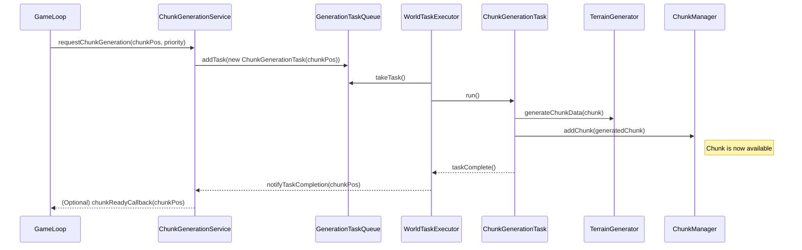

# Multithreaded Chunk Generation Design Document

## 1. Introduction

This document outlines the design for a multithreaded chunk generation system for the Voxel Game Engine. The primary goal is to offload computationally intensive tasks like chunk data generation and meshing (future) from the main game loop thread to worker threads. This will prevent hitches and ensure smooth gameplay, especially when the player is moving and new chunks need to be loaded and displayed rapidly.

This system will integrate with the existing `ChunkManager`, `ChunkGenerator`, and `TerrainGenerator` components.

## 2. Core Components

The multithreaded generation system will consist of the following key components:

*   **`WorldTaskExecutor` (or similar name):**
    *   Manages a fixed-size thread pool (e.g., using `java.util.concurrent.ThreadPoolExecutor`). The number of threads will be configurable, possibly based on available CPU cores.
    *   Responsible for executing submitted generation tasks.
    *   Handles proper initialization and shutdown of the thread pool.

*   **`GenerationTaskQueue`:**
    *   A thread-safe queue (e.g., `java.util.concurrent.PriorityBlockingQueue`) to hold pending chunk generation requests.
    *   Tasks will be prioritized, typically based on their proximity to the player, to ensure that chunks closer to the player are generated first.
    *   May have a maximum capacity to prevent an unbounded number of pending requests.

*   **`ChunkGenerationTask`:**
    *   A `Runnable` or `Callable` that encapsulates all the work required to generate a single chunk.
    *   Each task will be associated with a specific `ChunkPos`.
    *   Responsibilities:
        1.  Instantiate a `Chunk` object for the given `ChunkPos`.
        2.  Invoke the appropriate `TerrainGenerator` (e.g., `FlatTerrainGenerator`, `NoiseTerrainGenerator`) to populate the chunk's block data.
        3.  Set the chunk's state (e.g., to `ChunkState.GENERATED`).
        4.  (Future) Trigger chunk meshing if meshing is also done asynchronously.
        5.  Add the fully generated chunk to the `ChunkManager`.

*   **`ChunkGenerationService`:**
    *   A high-level service that acts as the main interface for other parts of the engine (e.g., game loop, world loading logic) to request chunk generation.
    *   It will manage the `WorldTaskExecutor` and the `GenerationTaskQueue`.
    *   Provides methods to:
        *   Submit a generation request for a `ChunkPos` (e.g., `requestChunkGeneration(ChunkPos pos, GenerationPriority priority)`).
        *   Potentially cancel pending tasks if they are no longer needed (e.g., player moved far away).
        *   Query the status of the generation queue or active tasks (for debugging/monitoring).

*   **`TaskResultHandler` / Callback Mechanism:**
    *   A mechanism to process the results of chunk generation. Since `ChunkManager` is thread-safe, `ChunkGenerationTask` can directly add the generated chunk.
    *   However, other systems (like the rendering system, for newly meshed chunks) might need to be notified upon task completion. This could be achieved via:
        *   A separate queue of "completed tasks" or "newly ready chunks" that the main thread polls.
        *   Callbacks executed on the main thread (requires careful synchronization or using main-thread execution services).
        *   Using `CompletableFuture` for asynchronous operations where the main thread can attach actions.

## 3. Workflow

1.  **Initialization:**
    *   The `ChunkGenerationService` is initialized at game startup.
    *   It creates and configures the `WorldTaskExecutor` (thread pool) and the `GenerationTaskQueue`.

2.  **Task Submission:**
    *   When the game determines that new chunks are needed (e.g., based on player movement and view distance), it calls a method on the `ChunkGenerationService` (e.g., `requestChunkGeneration(ChunkPos pos, Priority priority)`).
    *   The service checks if a chunk at `pos` is already being generated or is already in `ChunkManager`.
    *   If not, it creates a new `ChunkGenerationTask` for the given `ChunkPos` and priority.
    *   This task is added to the `GenerationTaskQueue`.

3.  **Task Prioritization:**
    *   The `GenerationTaskQueue` (if a `PriorityBlockingQueue`) automatically orders tasks based on their priority. Tasks for chunks closer to the player will have higher priority.

4.  **Task Execution:**
    *   A worker thread from the `WorldTaskExecutor` dequeues the highest-priority task from the `GenerationTaskQueue`.
    *   The worker thread executes the `run()` (or `call()`) method of the `ChunkGenerationTask`.
    *   Inside the task:
        *   A new `Chunk` instance is created.
        *   The configured `TerrainGenerator` populates the chunk with block data.
        *   The chunk's state is updated (e.g., to `ChunkState.GENERATED`).
        *   The generated `Chunk` is added to the thread-safe `ChunkManager.getInstance().addChunk(newChunk)`.
        *   Logging occurs to track generation progress.

5.  **Result Handling & Notification:**
    *   Once a chunk is added to `ChunkManager`, it is available for other systems.
    *   If immediate action is needed on the main thread (e.g., scheduling a mesh upload to the GPU once meshing is also async), the `TaskResultHandler` mechanism comes into play. This might involve the `ChunkGenerationTask` posting a "completion event" to a main-thread queue.

6.  **Shutdown:**
    *   When the game is closing, the `ChunkGenerationService` initiates a graceful shutdown of the `WorldTaskExecutor`, allowing currently executing tasks to complete if possible and clearing the queue.

## 4. Thread Safety and Concurrency Considerations

*   **`ChunkManager`:** Already designed to be thread-safe (all public methods are `synchronized`). This simplifies adding generated chunks from worker threads.
*   **`BlockRegistry`:** Assumed to be immutable and fully initialized before any generation tasks start. Access should be safe.
*   **`TerrainGenerator` Implementations (e.g., `NoiseTerrainGenerator`):**
    *   Must be thread-safe if a single instance is shared across tasks.
    *   If they contain mutable state that is modified during generation (e.g., `FastNoiseLite` instance with changing seed or state per call without internal synchronization), then either:
        *   A new instance of the generator (and its dependencies like `FastNoiseLite`) should be created per task or per worker thread.
        *   The generator methods must be made re-entrant or synchronized.
    *   Given `FastNoiseLite` can be instantiated, creating an instance per worker thread or per task is a viable approach to avoid contention and ensure thread safety. The `ChunkGenerator` service (which will be used by tasks) currently takes a `TerrainGenerator` in its constructor. This `TerrainGenerator` might need to be cloned or a factory pattern used for tasks.
*   **`Chunk` Object:**
    *   A new `Chunk` instance is created per task, so no sharing issues during initial population.
    *   `setBlock()` methods are not inherently synchronized but are called on a non-shared `Chunk` instance within the task.
    *   `ChunkState` is `volatile`, ensuring visibility of state changes across threads.
*   **`WorldTaskExecutor` and `GenerationTaskQueue`:** These are standard Java concurrency utilities and are inherently thread-safe.

## 5. Error Handling

*   Errors during chunk generation within a `ChunkGenerationTask` (e.g., exceptions from `TerrainGenerator`) should be caught and logged.
*   The task should not add a partially generated or corrupted chunk to `ChunkManager`.
*   The system could implement a retry mechanism for failed tasks or mark certain positions as "failed to generate" to prevent repeated attempts.
*   The `ChunkGenerationService` might expose ways to query failed tasks.

## 6. Configuration

*   **Thread Pool Size:** Number of worker threads in `WorldTaskExecutor`. Should be configurable, defaulting to something sensible like `Runtime.getRuntime().availableProcessors() - 1` or a fixed small number.
*   **Queue Capacity:** Maximum number of pending tasks in `GenerationTaskQueue`.
*   **Priority Levels:** Definition of task priorities.

## 7. Diagrams

*(Placeholder for future: Sequence diagram showing task submission, execution, and result handling.)*

## 8. Integration with Game Loop

*   The `GameLoop` will no longer call `chunkGenerator.generateChunk()` directly for initial world population or dynamic loading.
*   Instead, it will interact with the `ChunkGenerationService` to request chunks.
*   A new system in the `GameLoop` or `game` module will be responsible for determining which chunks need to be loaded/generated based on player position and view distance, and then submit these requests to the `ChunkGenerationService`.

This design provides a foundation for asynchronous chunk generation. Future enhancements could include adding asynchronous meshing as part of the `ChunkGenerationTask` or as a subsequent dependent task.